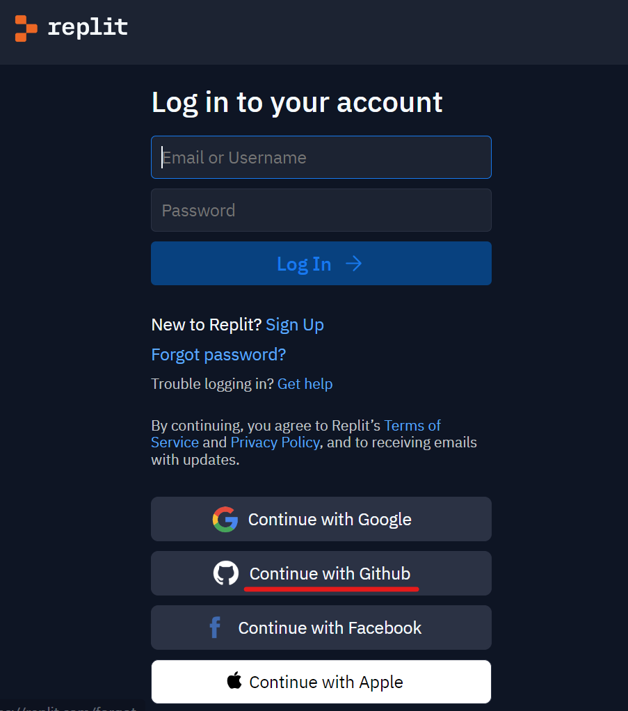

# Programming 101
In this course, you will learn the fundamental concepts of the Python programming language. This includes data types, variables, control flow, and user input/output. Uou will write and execute your very first program, as well as your second and maybe even third!

## Instructions (Please Complete Ahead of 1st Session)

- Create a GitHub account **[[CLICK HERE](https://github.com/login)]**
    - We won't be actively using GitHub until later courses, but we'll use our new login in the next step...
- Create a Replit accout **[[CLICK HERE](https://replit.com/login)]**
    - Log in using your new GitHub account!

### That's all!

Feel free play around with Replit (and even GitHub) ahead of time, but if you can log in, you're good to go for the first session.

See you then!
