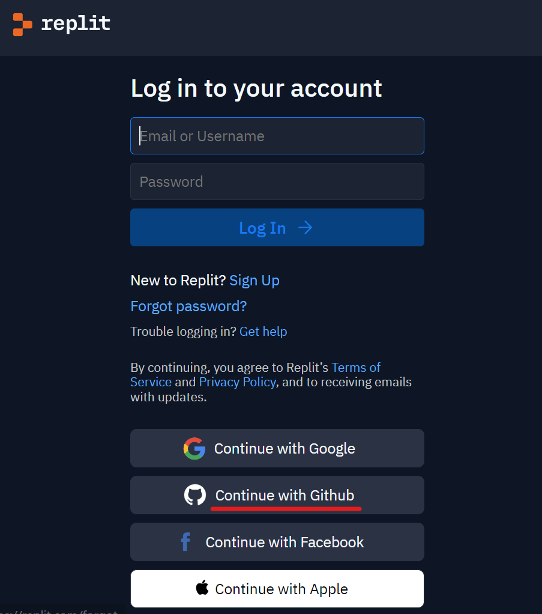

# Programming 101
Learn the basics of programming with Python in this introductory course by building real projects and learning real-world collaboration skills

## Introduction
This is the landing page for the Intro to Programming course given in conjuction with the [Akron Maker Space](https://akronmakerspace.org/). This page will change over time, so feel free to bookmark and reference back.

Thank you!

# First Session: Sunday Feb 5th @ 1:00 pm

#### [[SIGN UP NOW!]()]

**Date:** 2023-02-05  
**Time:** 1:00pm to 3:00pm  
**Location:** Virtual (meeting room link to be provided)  
**Fee:** $15/hr for AMS Members ($25/hr for non-members)

## Instructions (Please Complete Ahead 1st Session)

- Create a GitHub account **[[CLICK HERE](https://github.com)]**
    - We won't be actively using GitHub until later courses, but we'll use our new login in the next step...
- Create a Replit accout **[[CLICK HERE](https://replit.com)]**
    - Log in using your GitHub new account!

### That's all!

Feel free play around with Replit (and even GitHub) ahead of time, but if you can log in, you're good to go for the first session.

See you then!
